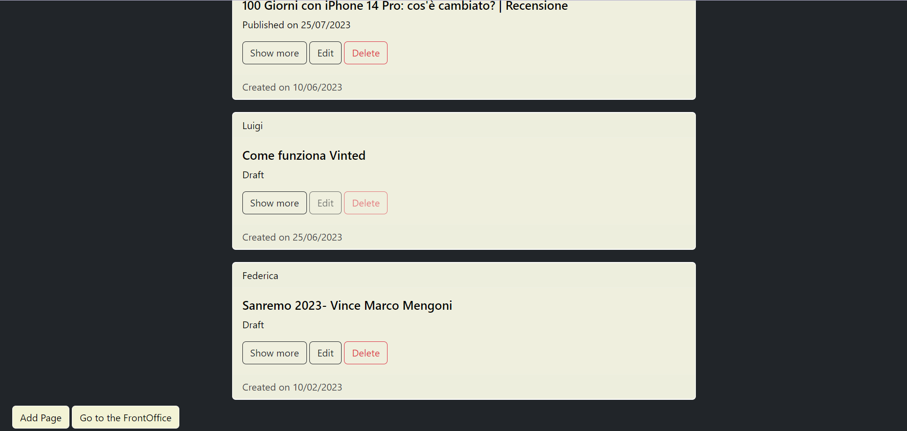

# Exam #12345: "Exam Title"

## Student: s310275 Amato Federica 

# Server side

## API Server

- POST `/api/editTitle`
  - request body: title
  
- GET `/api/getTitle`
  - response body: a title in the database
- GET `/api/page/:numPage`
  - request parameters: numPage
  - response body a single content Object
- GET `/api/editPage/:numPage`
  -request parameters: numPage
  -response body a single page object
- POST `/api/editPage/:numPage`
  - request parameters: numPage
  - request body: a single page object
- POST `/api/editContent`
  - request body: a single content object

- GET `/api`
  - response body: a list of content objects
- GET `/api/logged`
  - response body: a list of page objects
- GET `/api/users`
  - response body: a list of users

- POST `/api/addPage`
  - request body: a single page object
- POST `/api/addContent`
  - request body: a single content object
- DELETE `/api/deletePage/:numPage`
  - request parameters: a numPage
- DELETE `/api/deleteContent/:numPage`
  - request parameters: a numPage
- DELETE `/api/deleteContentById/:id`
  - request parameters: an id of the content

## Database Tables

- Table `users` - contains ID,EMAIL,PASSWORD,SALT,NAME,ADMIN
- Table `pages` - contains id,title,author,creation_date,publication_date,admin
- Table `content`- contains id,pageID,type,content,user,ordered
- Table `title` - contains id,title

# Client side

## React Client Application Routes

- Route `/`: the page includes the MainLayout or the DefaultLayout according to the state of the user, if we are not logged we see   only the published page
- Route `/loging`: page includes the login form
- Route `/editPage/:numPage` contains the Layout for the editing of a page
- Route `/setTitle` contains the layout for editing the title of a page, it is visible ony for admin user
- Route `/addPage` contains the layout for adding a page
- Route `/addContent/:numPage` contains the form for adding some blocks of contents
- Route `/page/:numPage` it shows the content of a page, including all its contents

## Main React Components

- `Content` (in `Page.js`): it stores the block of content,it is usefull to store data which are taken from the database
- `Page` (in `Page.js`): it stores the pages,it is usefull to store data which are taken from the database
- `User` it stores the users,it is usefull to store data which are taken from the database
- `PageRow` (in ListPage.jsx): it is usefull to have a list of Pages in the page using the "Card" from react-bootstrap
- `ContentRow` (in ShowPage.jsx) : it takes one component at a time, showing the value of the content
-`MainLayout` (in Layout.jsx) it is used to show the initial page for authenticated user,it has a list of all the publicated pages
- `DefaultLayout` (in Layout.jsx): it is used to show the list of pages having an authenticated user, so it shows the list of all pages,even the unpublished one.
- `EditForm` and `AddForm` (in AddOrEditForm.jsx): it is used to show the form for editing /adding the properties of the page
- `EditContent` and `AddContentForm` (in AddOrEditForm.jsx): it is used to show the form for editing/adding content to the page
-`LoginForm` (in Auth.jsx): it is used to show the form in order to authenticate an user

(only _main_ components, minor ones may be skipped)

# Usage info

## Example Screenshot

## Users Credentials

- username: Maddalena, email: madda@polito.it, password:madda (plus any other requested info)
- username: Federica, email: fede@polito.it, password: federica (plus any other requested info)
- username: Agata, email: agata@polito.it, password: agata (plus any other requested info)
- username: Luigi, email: luigi@polito.it, password: ciao (plus any other requested info)
